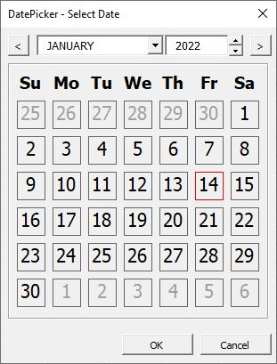

<div align="center">
  
</div>

# VBA_DatePicker
VBA_DatePicker is a datepicker written in VBA. It was developed for developers to provide a way for users to select a date from a calendar.

## Setting up
1. Open a project in **Microsoft Visual Basic for Applications** (VBA editor).
2. Import the following files: (`File` > `Import File`)
   - `DatePickerDayLabel.cls`
   - `DatePickerMod.bas`
   - `FormDatePicker.frm` (Ensure that `FormDatePicker.frx` is within the same folder before importing)

## Usage
```
Dim result as Variant
result = DatePickerMod.selectDate()
```

> **Note:** `DatePickerMod.selectDate()` will return `Null` when the form is cancelled or closed.
